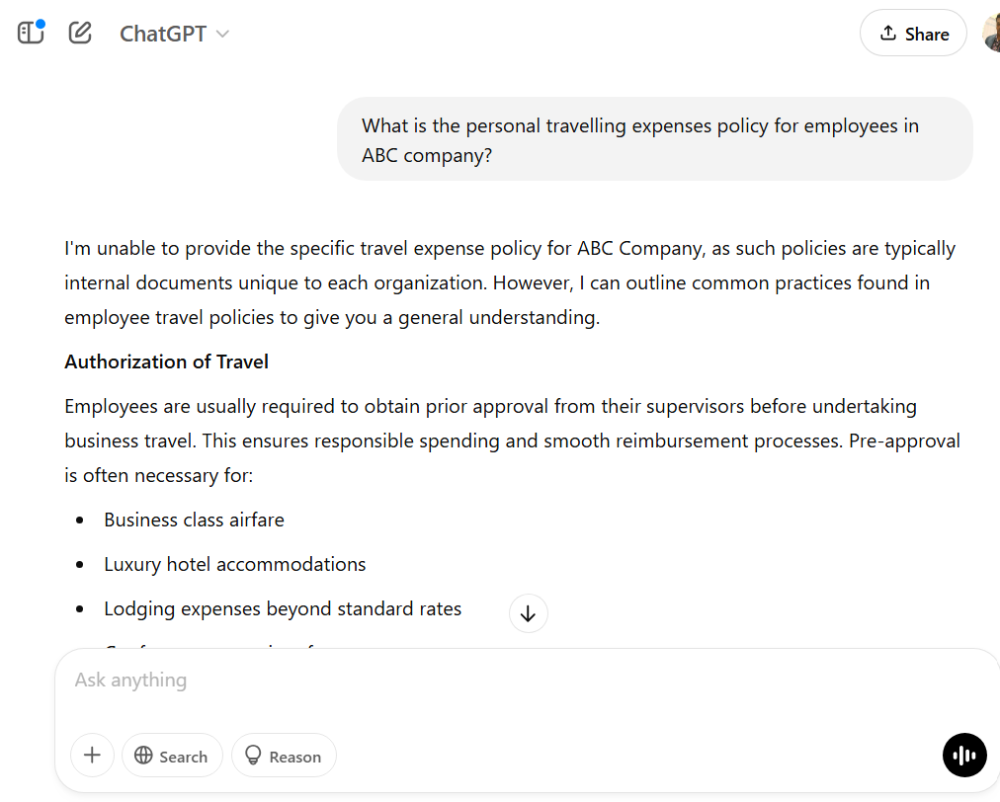
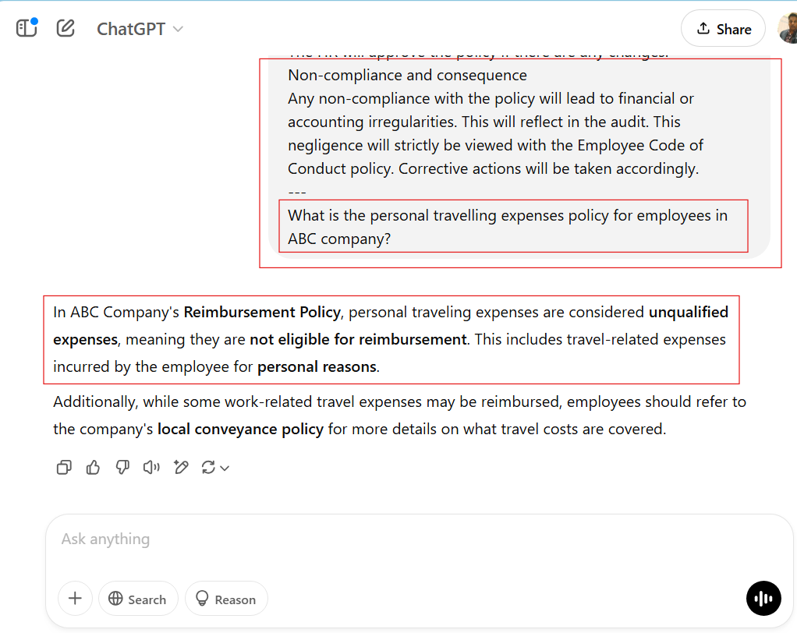

# Demo: Creating Effective prompts with Context data
This demos helps you to understand the importance of using context data to create effective prompts. Context aware prompts can generate more accurate and relevant results.

### Prerequisites
* [ChatGpt account](https://chatgpt.com/) or [Microsoft Copilot](https://copilot.microsoft.com/)

## Try prompts without context data.
1. Open ChatGPT website or Microsoft Copilot Website and try the below given prompt.

    ```
    What is the personal travelling expenses policy for employees in ABC company?
    ```

2. When you send the request, you may get a response that contains inaccurate and irrelevent information.

    

## Try prompts with context data
1. Open the `ABC_Company_Reimbursement_policy.docx` file. You can see the reimbursement policy details for the employees working in ABC company.
2. Open a blank notepad and write the following prompt. 

    ```
    Consider the below context data:
    ---
    <REPLACE THIS WITH THE REIMBURSEMENT POLICY INFORMATION FROM WORD DOCUMENT>
    ---
    What is the personal travelling expenses policy for employees in ABC company?
    ```
    
    **Update the prompt with the reimbursement policy defined in the word document.**

3. Copy the updated prompt that contains the context data from notepad and try in the ChatGPT or Microsoft Copilot website.
4. This time it will generate more accurate and relevent information about the reimbursement policy for employees in ABC company.

    

