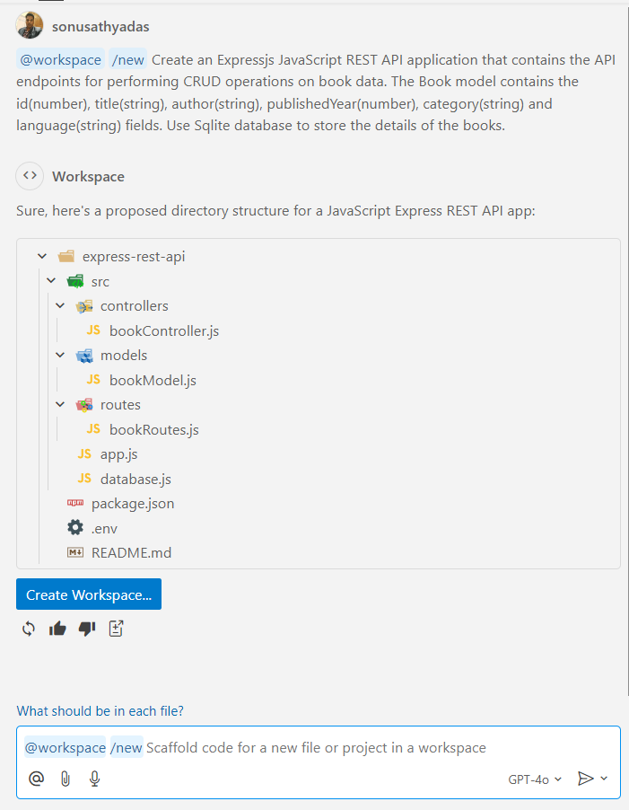

# Demo: Working with slash commands in GitHub Copilot
This demo helps you to understand the use of slash (/) commands in GHCP. Here we are going to create a simple Node and ExpressJS application using slash command in Copilot Chat.

### Prerequisites
* NodeJS 18 or later
* VS Code with GitHub Copilot Chat Extension
* GitHub Copilot Account

## Creating an ExpressJS API using GitHub Copilot

1. Open Visual Studio Code and open the GitHub Copilot chat window. 
2. If not already signed in to GitHub Copilot, sign in to the Copilot. 
3. In the prompt text box, try the `/new` command.

    ```
    @workspace /new Create an Expressjs JavaScript REST API application with the name books-api that contains the API endpoints for performing CRUD operations on book data. The Book model contains the id(number), title(string), author(string), publishedYear(number), category(string) and language(string) fields. Use Sqlite database to store the details of the books. 
    ```

4. This will suggest the project structure on the chat window. Click on `Create Workspace` button to save the project workspace on local system.

    

5. Open the saved project workspace in VS Code and install the required npm packages.
    
    ```
    npm install
    ```

6. Run the application using the following command.

    ```
    npm start
    ```

> [!WARNING]
> Generated code may contain errors. You may need to manually fix the errors or use Copilot to fix the errors to run it successfully.
