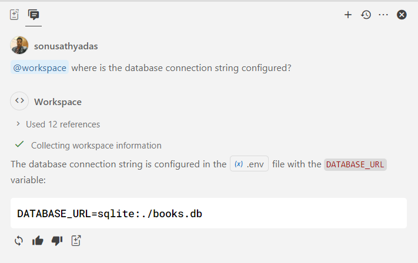
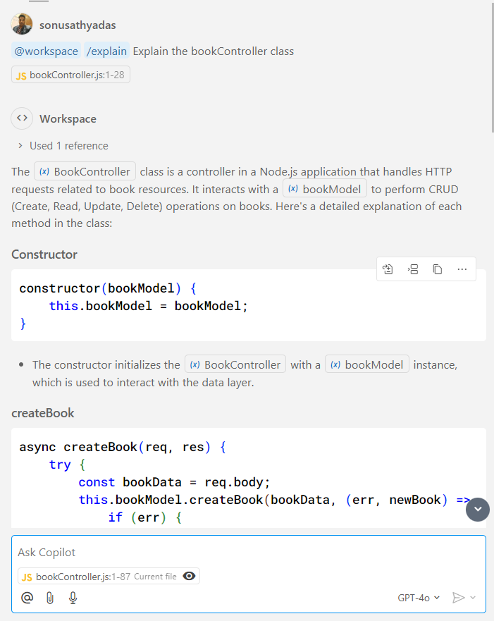
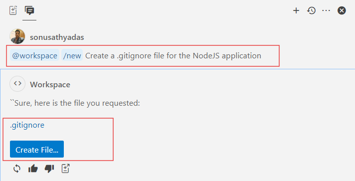
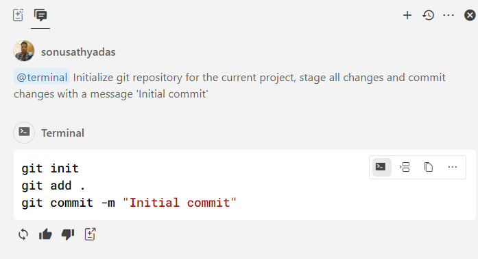
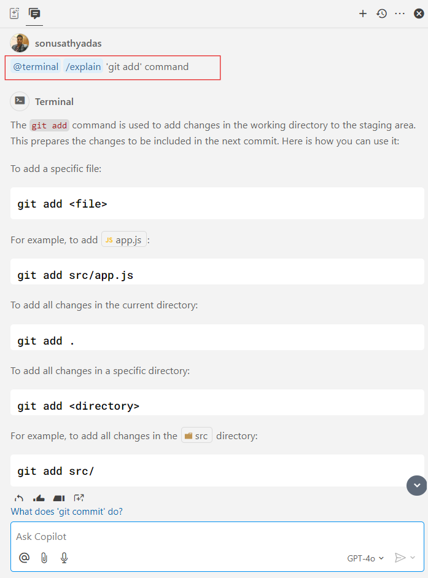

# Demo 08: Using Contextual commands in GitHub Copilot Chat

In GitHub Copilot Chat, `@workspace` and `@terminal` are contextual commands that help Copilot understand where to apply its responses. They specify the scope or location where Copilot should perform actions.

### Prerequisites
* VS Code 
* GitHub Copilot Chat Extension for VS Code
* NodeJS 18 or later
* GitHub Copilot subscription
* Book API project 

## Working with @workspace contextual command
1. Open the `book-api` project in VS Code.
2. Open the GitHub Copilot Chat and run the following prompt with the @workspace contextual command.

    ```
    @workspace where is the database connection string configured?
    ```

3. Below is the response generated by GitHub Copilot

    

4. Open the `bookController.js` file in editor. Run another prompt with the @workspace context command

    ```
    @workspace /explain What is the use of bookController class
    ```

5. This will give a response that explains the use of `bookController` class

    

6. Add a new `.gitignore` file to the project using the following prompt

    ```
    @workspace /new Create a .gitignore file for the NodeJS application
    ```
7. This will generate the `.gitignore` file for the project and click on the `Create File` button to save the file with the name `.gitignore` inside the project folder.

    

## Working with @terminal command
1. Open the `book-api` project in VS Code and run the following prompt in the GitHub Copilot Chat window.

    ```
    @terminal Initialize git repository for the current project, stage all changes and commit changes with a message 'Initial commit'
    ```

2. Copilot will suggest the required `git` commands. Click on the `Insert into Terminal` icon on top of the generated command.

    

3. Try another prompt in the Copilot chat.

    ```
    @terminal /explain  'git add' command 
    ```

4. This will explain the use of `git add` command with examples

    

