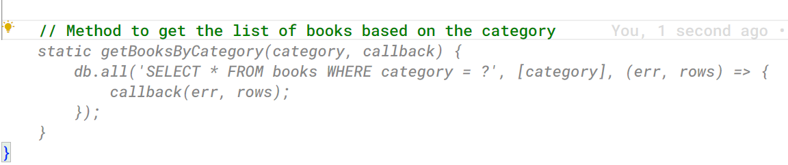
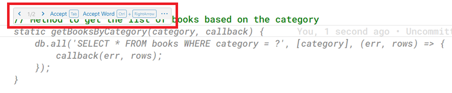
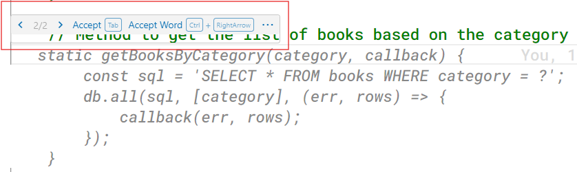
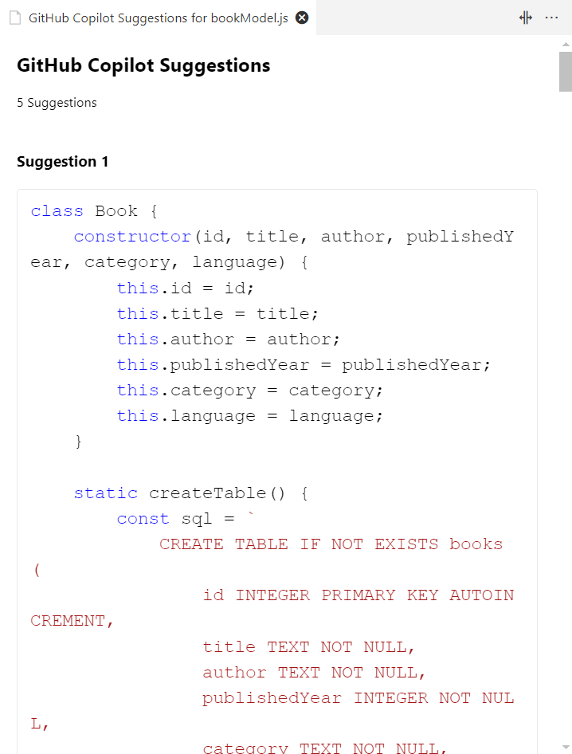

# Demo: Generating code from Comments using GitHub Copilot

This demo helps you to understand how to use comments to generate code in applications. 

### Prerequisites
* VS Code 
* GitHub Copilot Extension for VS Code
* GitHub Copilot subscription
* NodeJS 18 or later
* Book API application 

## Generate code from comments 
1. Open the `book-api` application using VS Code.
2. Open the `bookModel.js` file and type the following comment at the end of the class after the `deleteBook` method.

    ```
    // Method to get the list of books based on the category
    ```
3. After you type the comment, press Enter key. The GitHub Copilot Extension will start generating suggestions based on the comment.
    
    

4. Press `Tab` key to accept the complete suggestion or press `Ctrl + Right Arrow` to accept word by word .Press `Esc` to discard the suggestion.
5. If you hover the mouse on top of the suggestion it will show the pop up on which you can click on the left or right arrows to navigate between suggestions.

    

6. Click on the right arrow in the popup to navigate to the next suggestion or press `Tab` to accept the current suggestion.
    
    

7. Alternatively, you can press `Ctrl + Enter` to open the suggestions list.
    
    

8. You can scroll down through the suggestions and accept any one suggestion you want. 