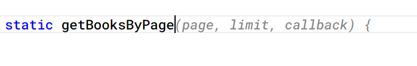
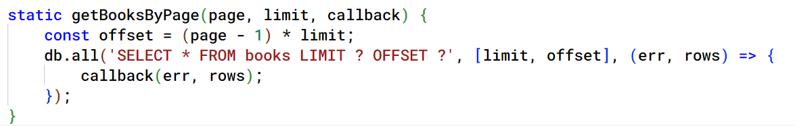
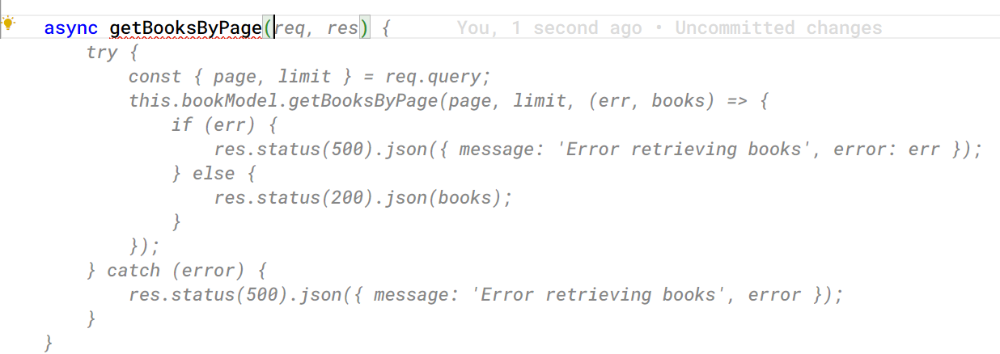
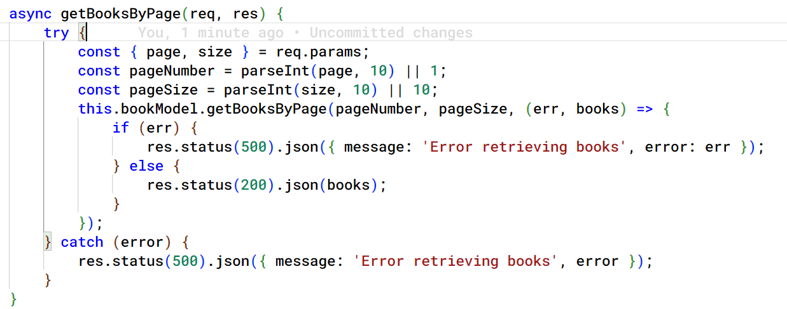
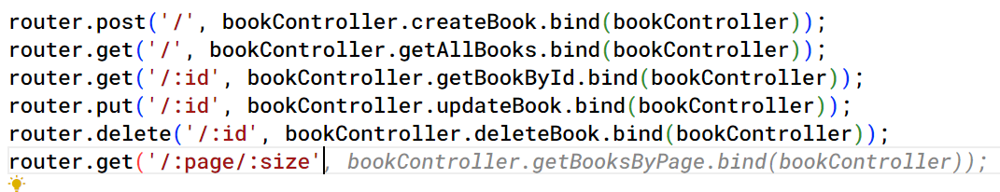
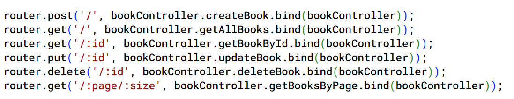

# Demo: Generating code completions using GitHub Copilot
GitHub Copilot can suggest the code when you type on the editor. When you create a class, function or declare a variable or constant, Copilot can suggest the autocompletions.

### Prerequisites
* VS Code
* GitHub Copilot Extension for VS Code
* GitHub Copilot subscription
* NodeJS 18 or later
* Book API project

## Generating code completions and autosuggestions

1. Open the `book-api` Nodejs project in VS Code.
2. Open the `bookModel.js` file and start typing at the end of the class. Add a new method for retrieving the list of books using pagination. Start typing the function name and GitHub Copilot will suggest the autocompletions.

    

3. Press the `Tab` key to accept the suggestions. 

    

4. Open the `bookController.js` file from the `controllers` folder. Add a new method by typing the name of the async method.

    

5. Press `Tab` to accept the suggestions.

    

6. Open the `bookRoutes.js` file from `routes` folder and add a new route by typing the route configuration

    

7. Complete the suggestion by pressing `Tab`.

    

8. Run the application by running the following command.

    ```bash
    npm start
    ```
    