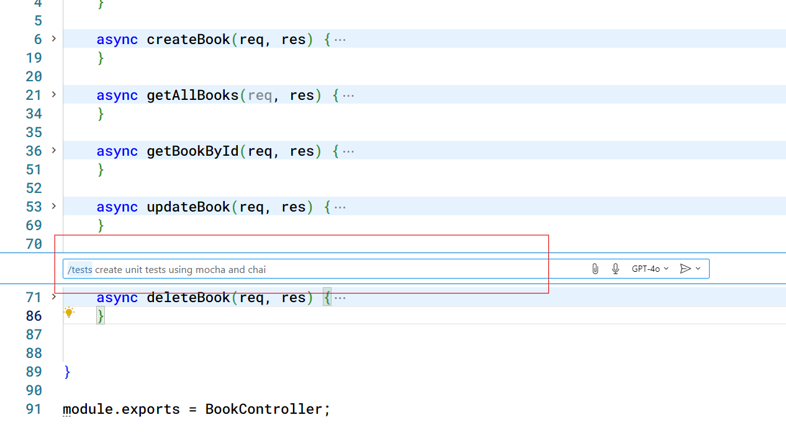
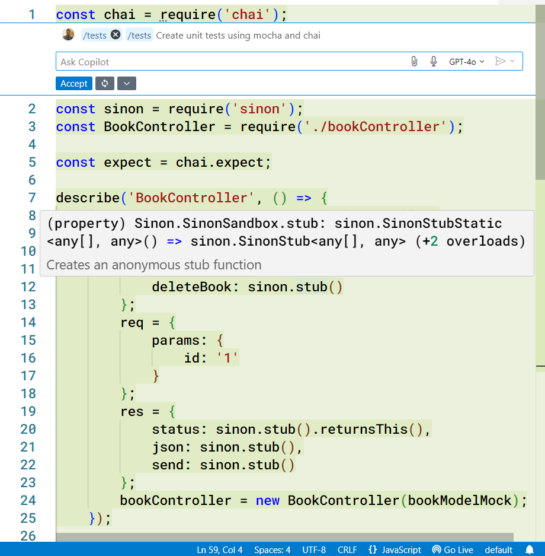
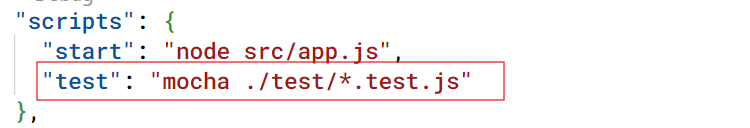
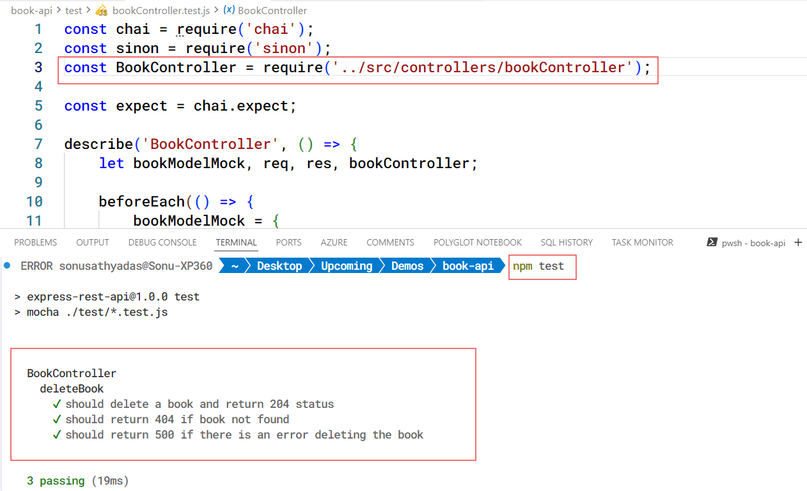

# Demo: Generating unit tests using GitHub Copilot

You can generate unit test cases for your code using GHCP. It can generate unit tests for different languages including C#, Java, JavaScript, Python etc. It can produce code for various unit test frameworks.

### Prerequisites
* VS Code
* GitHub Copilot extension for VS Code
* GitHub Copilot subscription
* NodeJS 18 or later
* Book API project

## Generating unit tests for NodeJS application 

1. Open the `book-api` project in VS Code.
2. Install the testing framework `mocha` and assertion library `chai` in the application

    ```bash
    npm install -D mocha chai sinon
    ```

3. Open the file `bookController.js` in the editor.
4. Press `Ctrl+I` to open the Inline chat and use the `/tests` command with the following prompt.
    
    ```
    /tests Create unit tests using mocha and chai
    ```

    

5. This will generate a new file with all test cases. Save the file in `/test/bookController.test.js` file. 

    

6. Open the `package.json` file and add a script to run the tests

    

7. Run the test cases

    ```bash
    npm test
    ```
    
    **If required update the paths in the import statements**
    
    

    
    
    
    