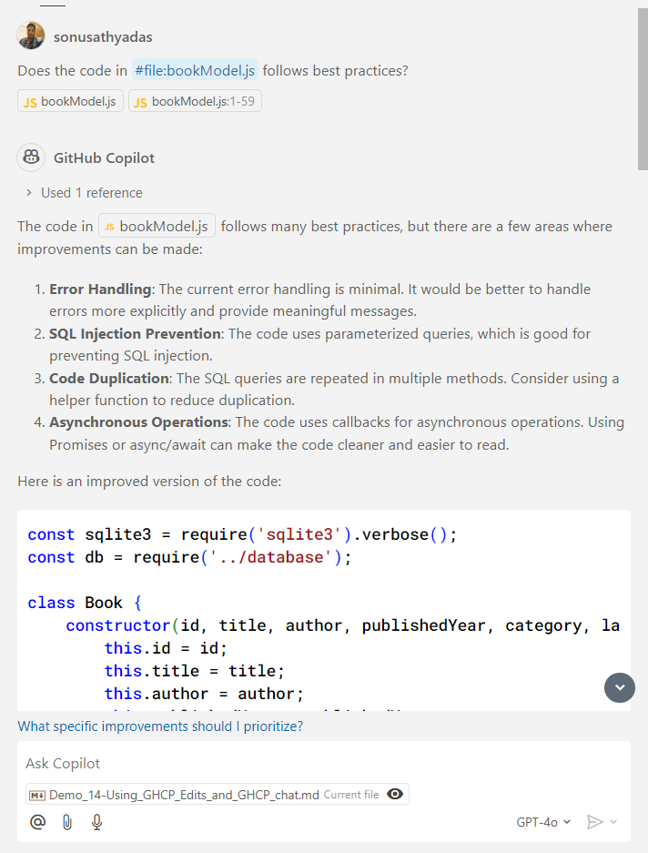
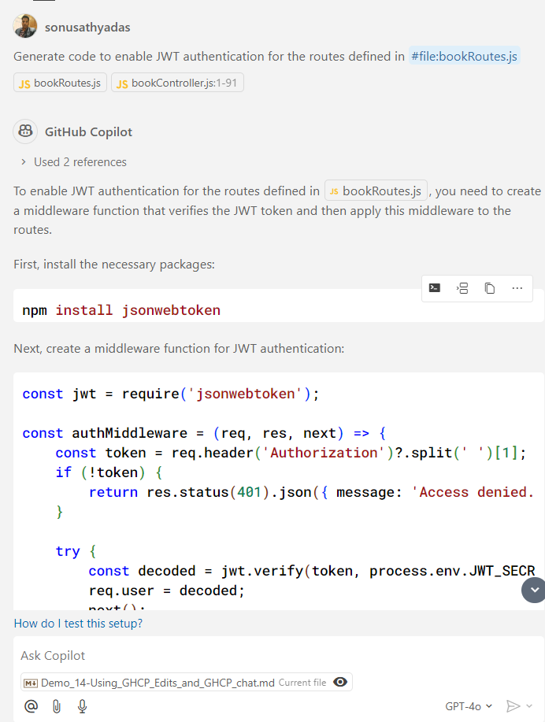

# Demo : Working with GitHub Copilot Edits and GitHub Copilot chat

GitHub Copilot Edits suggests code completions and edits directly within your editor. Works in the background as you type, providing real-time suggestions for completing lines of code, fixing bugs, or improving code snippets. Its focus is on automated code-writing and editing assistance to make your work faster and more efficient.

GitHub Copilot Chat is a conversational tool that allows you to interact with Copilot via a chat interface. You can ask questions, troubleshoot issues, or request guidance in a more interactive way. I is ideal for debugging, learning new concepts, or understanding unfamiliar code as it lets you have a dialogue with Copilot for deeper context.

### Prerequsitites
* VS Code
* GitHub Copilot extension for VS Code
* GitHub Copilot subscription
* NodeJS 18 or later
* Book API project

## Using Copilot Chat
1. Open the `book-api` project in VS Code.
2. Use the Copilot Chat to review and validate the `bookModel.js` file. Open the Copilot Chat and write the following prompt

    ```
    Does the code in #file:bookModel.js  follows best practices?
    ```

3. The Copilot Chat responds as follows:

    

4. Try the following prompt to add JWT authentication for the web application.

    ```
    Generate code to enable JWT authentication for the routes defined in #file:bookRoutes.js 
    ```

5. This will generate the code and steps required to add JWT authentication for the `book-api` application. You need to execute the commands and copy the codes to appropriate files manually.

    

**DO NOT update the code in the editor. Discard the suggestions in the chat. We will be updating the code using the Copilot Edits in the next Task** 

## Using Copilot Edits
